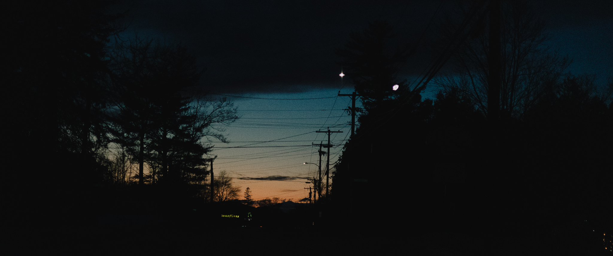
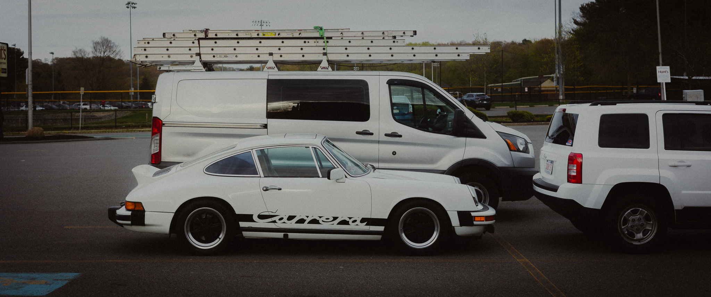
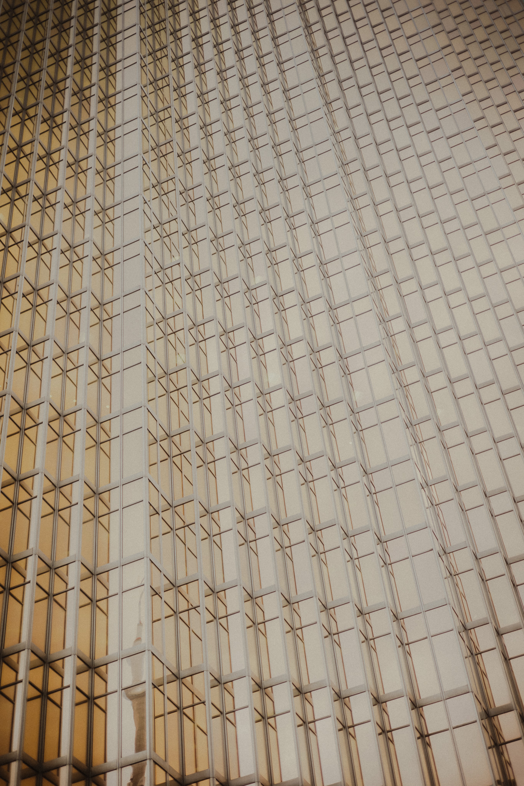

    "whatever happens, happens." 
	 - spike spiegel

<!--more-->

---
<!-- church -->

    

    <b>
    <i> every day </i>  
    <i> i will write you some words </i>  
    <i> hoping you will remember me </i>  
    <i> you don't have to be mine forever </i>  
    <i> as long as you remember me </i>  
    <i> thats enough </i>  
     
    <i> a great person, his deeply rational mind </i>  
    <i> can effortlessly control those overwhelming emotions </i>  
     
    <i> flowers bloom and then wither again </i>  
    <i> stars shine so brightly but the light still fades one day </i>  
    <i> everything is just a short encounter and it all returns to the eternity of death </i>  
    <i> no matter what dont forget you are never alone </i>  
    <i> i hope you are happy </i>  
    <i> i wish you peace </i>  
    <i> and i miss you </i>  
     
    <i> my dear angel </i>  
    <i> my only angel </i>  
     

---
<!-- church -->

    

    <b>
    <i>i think today is the day that i think about you all the time</i>  
    <i>i think today is the day that i think about you all the time</i>  
    <i>i think today is the day that i think about you all the time</i>  
    <i>i think today is the day that i think about you all the time</i>  
    <i>i think today is the day that i think about you all the time</i>  
    <i>i think today is the day that i think about you all the time</i>  
    <i>i think today is the day that i think about you all the time</i>  
    <i>i think today is the day that i think about you all the time</i>  
    <i>i think today is the day that i think about you all the time</i>  
    <i>i think today is the day that i think about you all the time</i>  
    <i>i think today is the day that i think about you all the time</i>  
    <i>i think today is the day that i think about you all the time</i>  
    <i>i think today is the day that i think about you all the time</i>  
    <i>i think today is the day that i think about you all the time</i>  
    <i>i think today is the day that i think about you all the time</i>  
    <i>i think today is the day that i think about you all the time</i>  
    <i>i think today is the day that i think about you all the time</i>  
     

---
<!-- anya -->

    

    <b>
    "anya" <i>(adaptive neuro-symbolic ai)</i>  
    is designed for autonomous multi-step   
    theorem proving and verification in [bsm](https://en.wikipedia.org/wiki/Physics_beyond_the_Standard_Model)  
    hosted on [github](https://github.com/shusheaan/anya)  
     

---
<!-- 911 -->

    

    

---
<!-- m3 -->

    

---
<!-- toronto -->

    

---
<!-- me -->

    

---
<!-- misc -->

    

---
<!-- cover -->

    

---
<!-- fear -->

    <b>
    alleluia  
     
    my god won't deny me  
    tell the devil get behind me  
     
    my soul cries out hallelujah   
    and i thank god for saving me  
     
    i rather be free, i rather be free  
    i want freedom more than anything  
    i love freedom more than anything  
     
    i will control what i can control  
    i will let go what i can let go  
     
    patience i must have  
     
    ...  
    so when i'm free  
    i'm free  
     

---
<!-- icasp -->

    

    

---
<!-- mystic river -->

    

---
<!-- fear -->

    <b>
    i must not fear  
     
    i must not fear  
    fear is the mind-killer  
    fear is the little-death  
    that brings total obliteration  
     
    i will face my fear  
    i will permit it to pass over me  
    and through me  
    and when it has gone past  
    i will turn the inner eye to see its path  
     
    where the fear has gone  
    there will be nothing  
     
    only i will remain  
     

---
<!-- icasp -->

    

---
<!-- ps -->

    

    

---
<!-- statue -->

    

    

---
<!-- vg -->

    

---
<!-- harvard -->

    

    

    

---
<!-- fall -->

    

---
<!-- seaport -->

    

    

    

---
<!-- plaza -->

    

    

    

---
<!-- mit -->

    

    

    

    

    

    

---
<!-- shy bird -->

    

    

    

