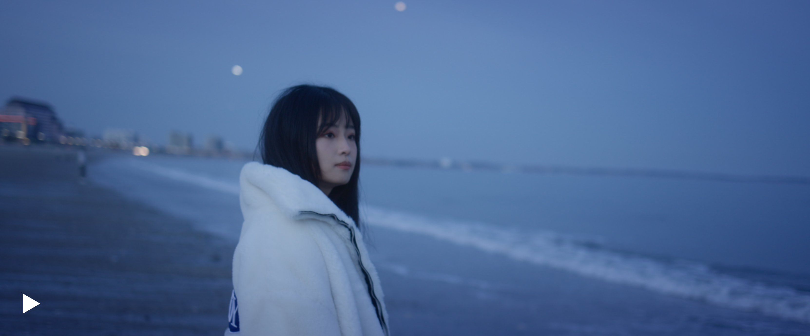
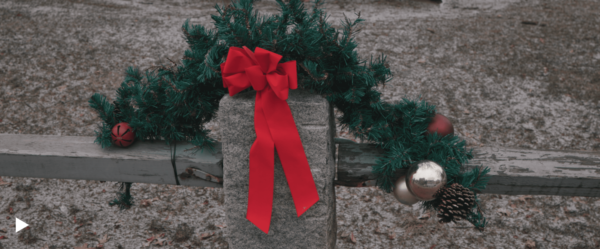
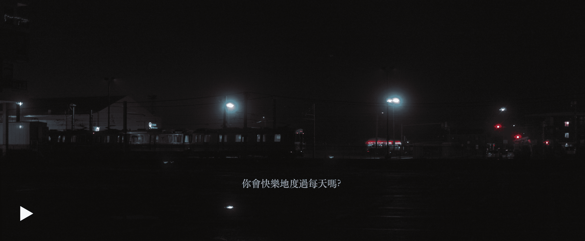
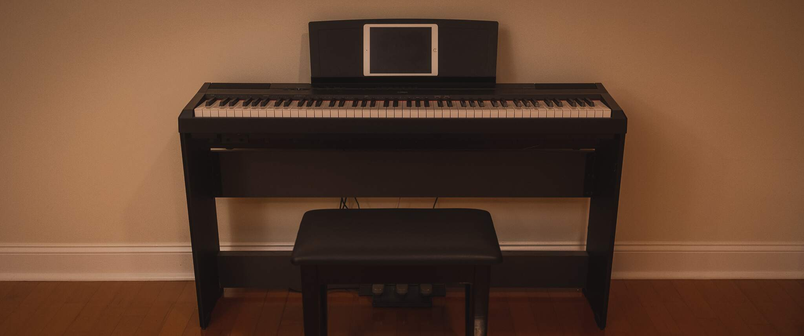
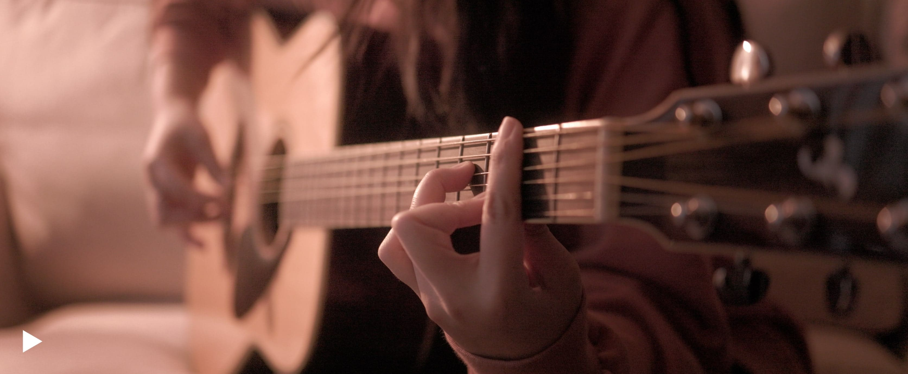
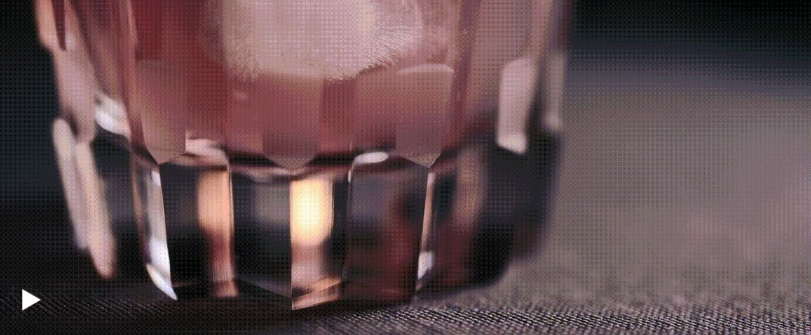
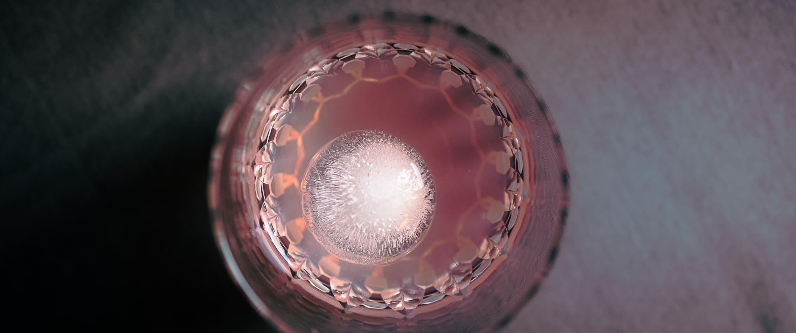
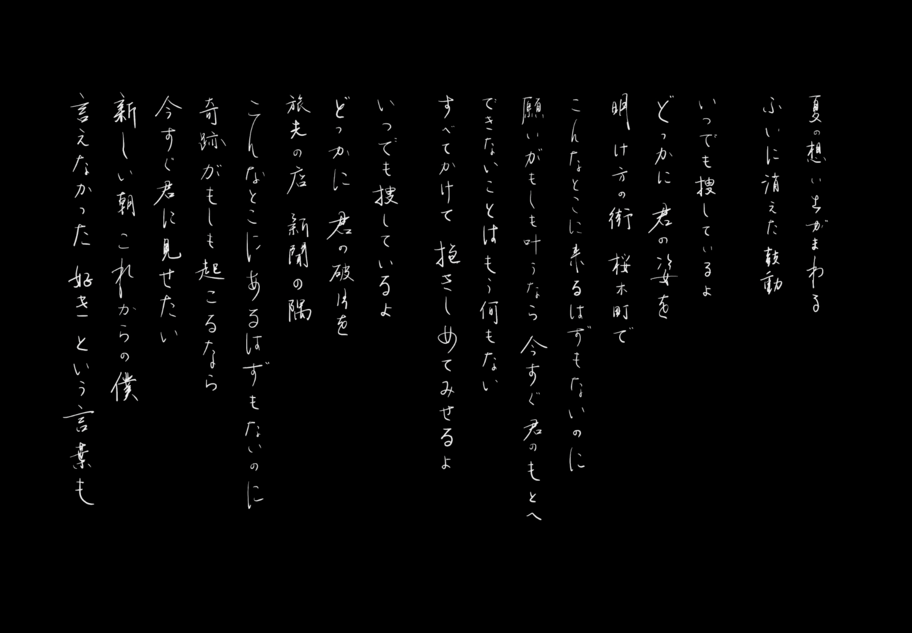
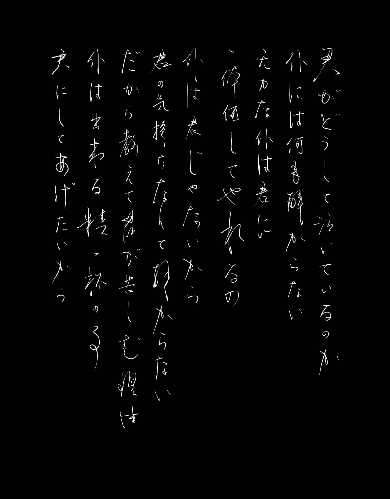
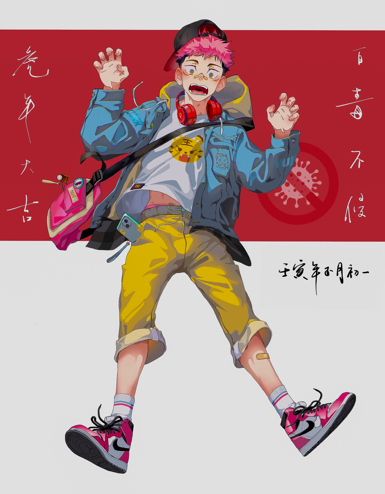

    "when i see anything, i see a lot of things." 
     - howard finster

<!--more-->

---
<!-- xinyu blue -->

    <audio controls>
      <source src="../../audio/may1st.mp3" type="audio/mpeg">
    Your browser does not support the audio element.
    </audio>

    <b>
    "may 1st" by beach fossils  
       

---

    

---
<!-- holiday -->

---
<!-- chords -->

---
<!-- kagami -->

    <b>
    said kozo kagami: "we should pursue creation of true  
    value refraining from short-sighted, ephemeral creativity"  
    and endorsed the idea of “monozukuri-no-kokoro” or passion  
    for manufacturing excellence. based on this principle the  
    company intends to continue its relentless efforts to  
    enhance technologies, skills and commitment in offering  
    products of high standards of technique and creativity,  
    bringing hope and brilliance to your life through  
    long lasting, high-quality glassware.  
    </b>

---
<!-- long -->

    

    

    

---
<!-- calli -->

    <b>
    《one more time, one more chance》 by 山崎まさよし  
    《秒速5センチメートル》主题曲 
    传统纵书，行书，自右向左阅读 
    </b>

 
 

    

    <b>
    《今、このとき。》 by 柊  
    《夏目友人帐》主题曲  
    传统纵书，行草，自右向左阅读 
    </b>

---
<!-- zed -->

    

    <b>
    いたどり ゆうじ in 呪術廻戦  
    by my extremely talented friend 
    <a href="http://zeyang.xyz/stories"> ze yang</a>  
    calligraphy by me :D  
     
    happy tiger year!  

