

    <i>
    "a beautiful body perishes, but a work of art dies not." 
     - leonardo da vinci
     </i>

<!--more-->

---
<!-- xinyu blue -->

<a href="#" data-featherlight="../../images/visuals/114.gif">
    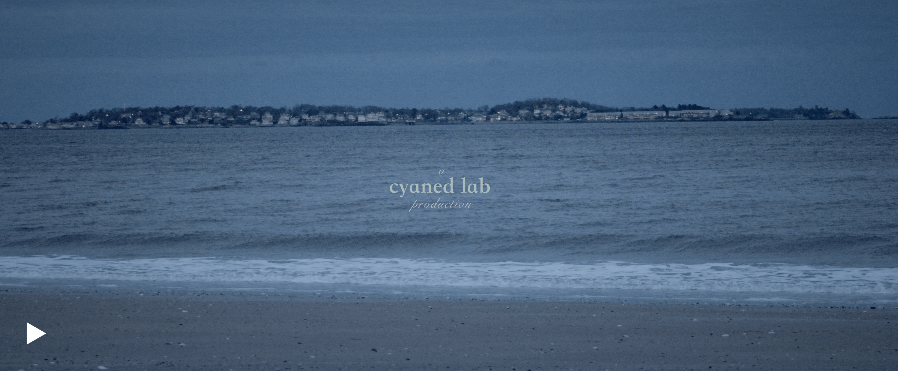</a>

<a href="#" data-featherlight="../../images/visuals/119_2.gif">
    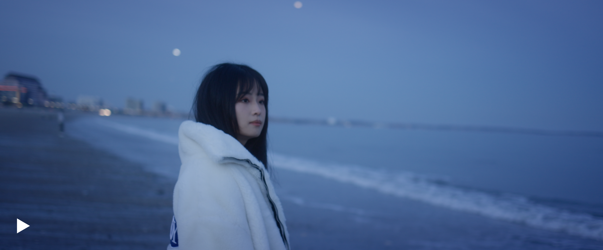</a>

    <audio controls>
      <source src="../../audio/may1st.mp3" type="audio/mpeg">
    Your browser does not support the audio element.
    </audio>

    <b>
    "may 1st" by beach fossils  
       

---
<!-- xinyu bin -->

<a href="#" data-featherlight="../../images/visuals/197.gif">
    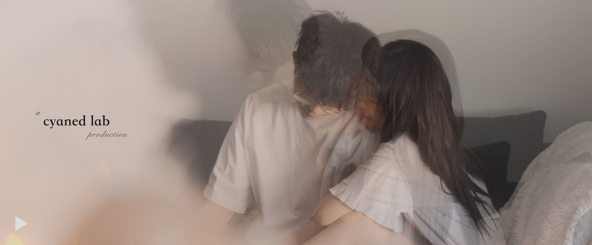</a>

    <audio controls>
      <source src="../../audio/dance.mp3" type="audio/mpeg">
    Your browser does not support the audio element.
    </audio>

    <b>
    "dance till we die" by lana del rey  
      

<a href="#" data-featherlight="../../images/visuals/201.jpg">
    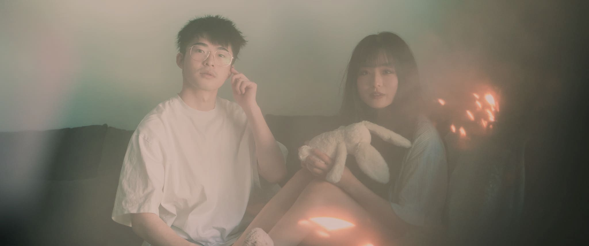</a>

---
<!-- holiday -->

<a href="#" data-featherlight="../../images/visuals/42.gif">
    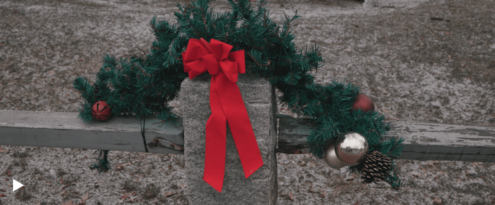</a>

<a href="#" data-featherlight="../../images/visuals/63.gif">
    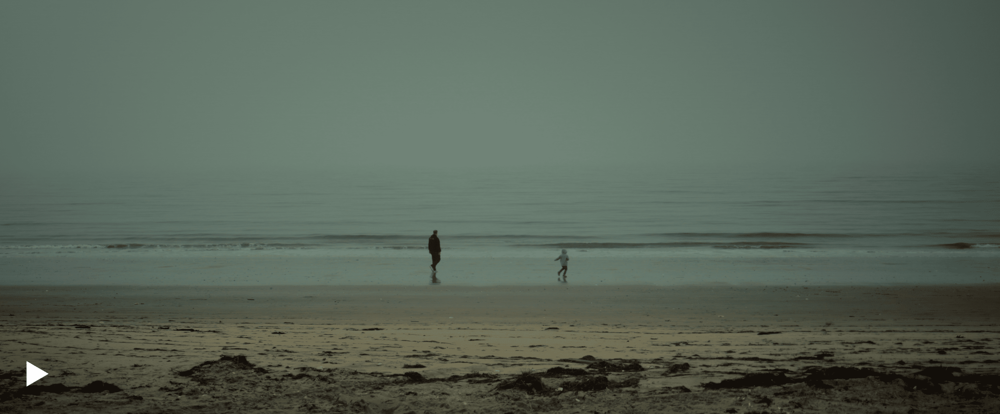</a>

<a href="#" data-featherlight="../../images/visuals/64.gif">
    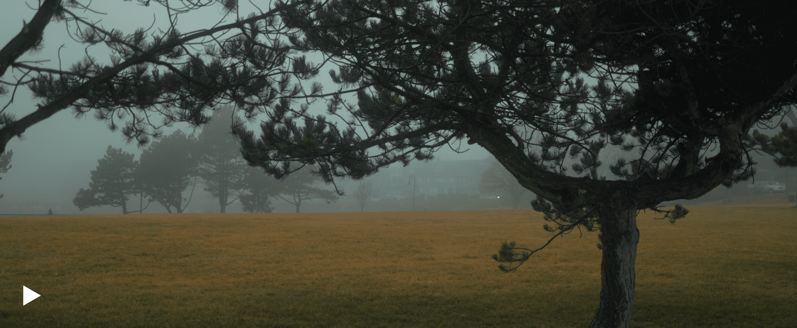</a>

<a href="#" data-featherlight="../../images/visuals/66.gif">
    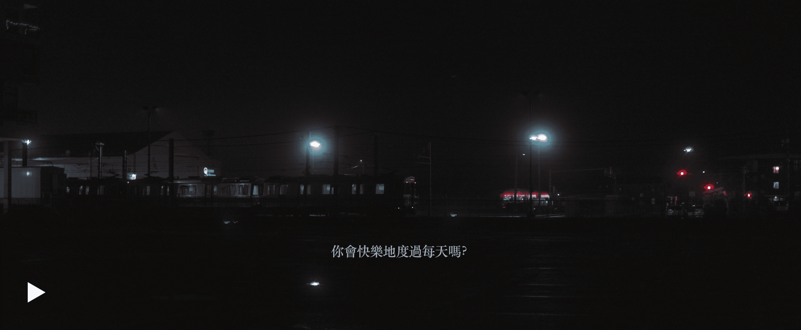</a>

---
<!-- chords -->

<a href="#" data-featherlight="../../images/visuals/107.jpg">
    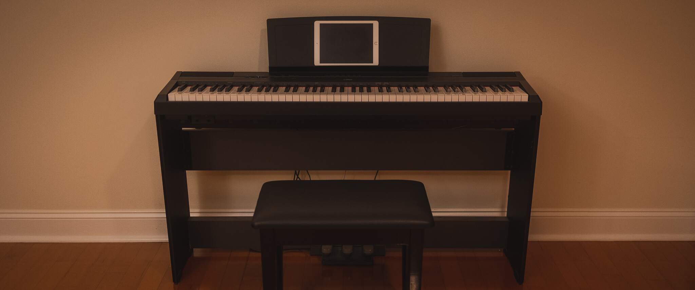</a>

<a href="#" data-featherlight="../../images/visuals/124.gif">
    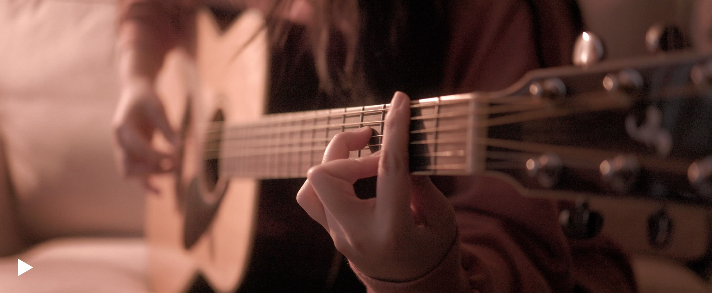</a>

<a href="#" data-featherlight="../../images/visuals/126.gif">
    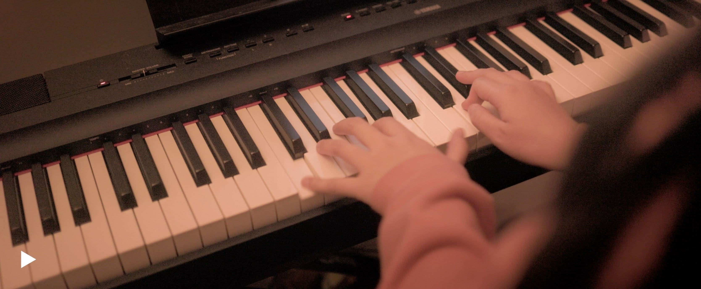</a>

---
<!-- kagami -->

<a href="#" data-featherlight="../../images/visuals/0.gif">
    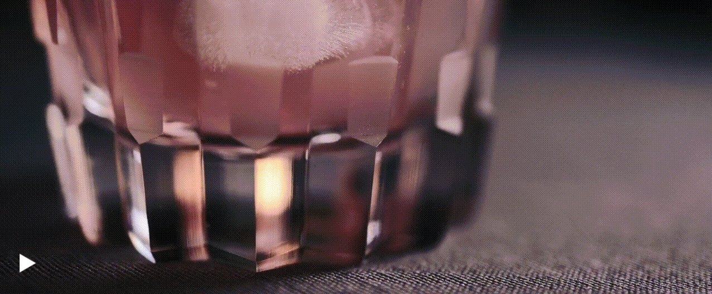</a>

<a href="#" data-featherlight="../../images/visuals/206.jpg">
    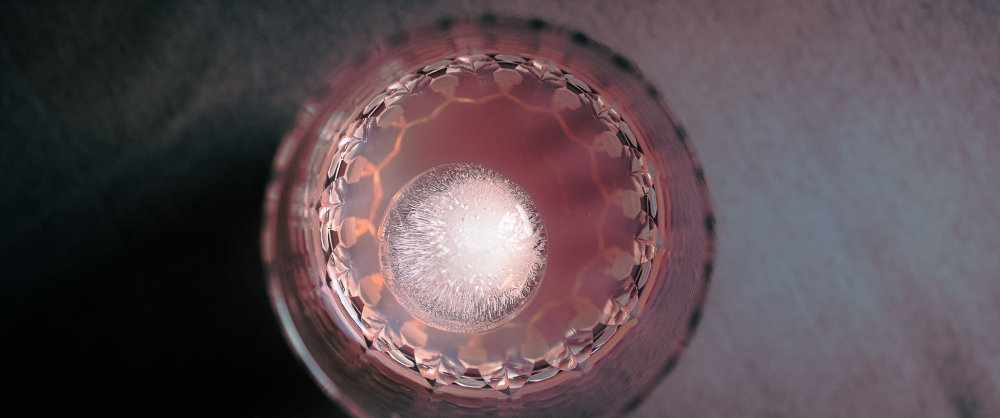</a>

    <b>
    said kozo kagami: "we should pursue creation of true  
    value refraining from short-sighted, ephemeral creativity"  
    and endorsed the idea of “monozukuri-no-kokoro” or passion  
    for manufacturing excellence. based on this principle the  
    company intends to continue its relentless efforts to  
    enhance technologies, skills and commitment in offering  
    products of high standards of technique and creativity,  
    bringing hope and brilliance to your life through  
    long lasting, high-quality glassware.  
    </b>

---
<!-- anavoy -->

<a href="#" data-featherlight="../../images/visuals/186.jpg">
    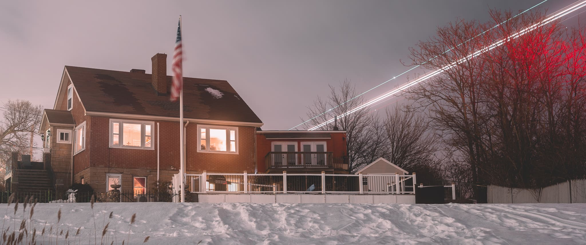</a>

<a href="#" data-featherlight="../../images/visuals/187.jpg">
    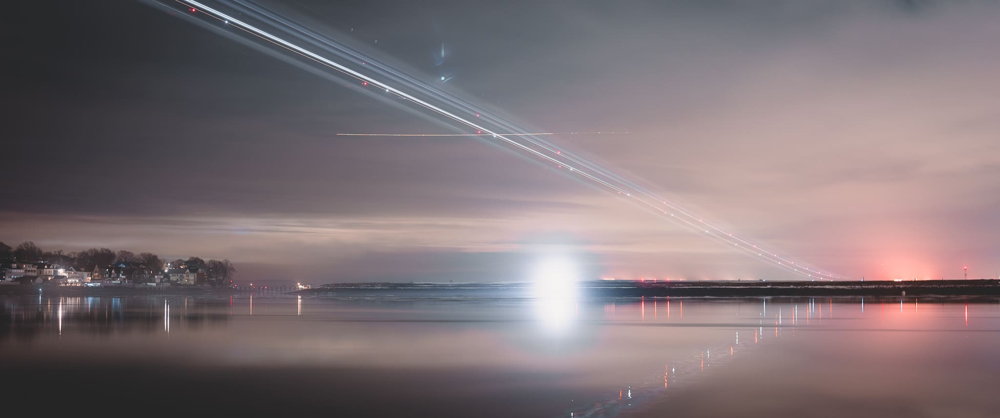</a>

<a href="#" data-featherlight="../../images/visuals/207.jpg">
    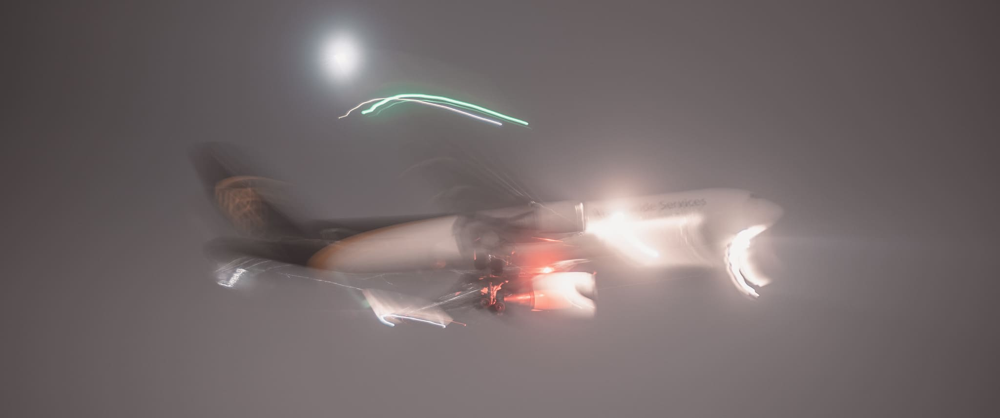</a>

    shot on mitakon speedmaster 50mm f/0.95 iii  
    boston logan international airport  
    bayswater st x annavoy st  

---
<!-- anavoy -->

<a href="#" data-featherlight="../../images/visuals/75.png">
    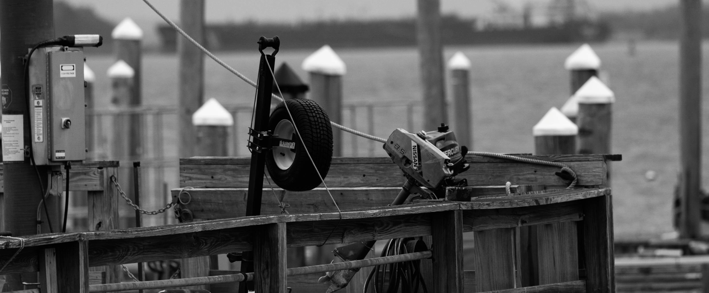</a>

    <b>
    麻省的温斯洛普镇坐落在洛根机场旁，和主跑道   
    22R、22L、27和33L的接地区相隔一带浅湾，是我拍摄飞机的首要去处。  
     
    在数个拍摄点中，科塔公园游艇俱乐部是距离27和33L跑道接地区最近的  
    一个。每当海上刮西风时，我都会前往科塔俱乐部，拍摄来自遥远欧洲的   
    国际航班，从一望无际的大西洋地平线远方逐渐显现，带着数百乘客， 
    轻轻摇晃乘着风，直到在我面前接地。  
    </b>

<a href="#" data-featherlight="../../images/visuals/74.jpg">
    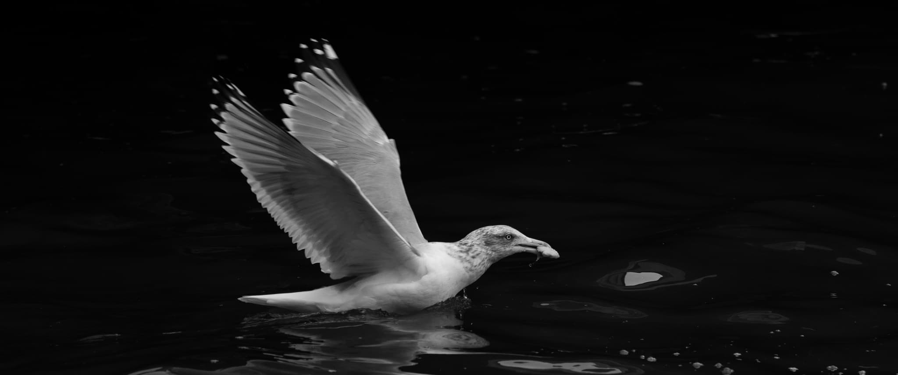</a>

<a href="#" data-featherlight="../../images/visuals/73.jpg">
    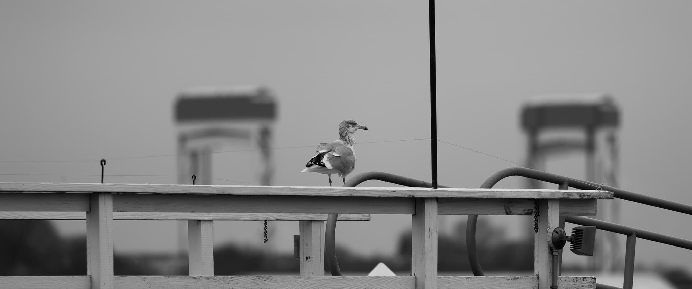</a>

    <b>
    在等待航班的空闲时间里，我也会随意拍摄周遭环境、游艇和野生动物。 
    </b>

<a href="#" data-featherlight="../../images/visuals/71.jpg">
    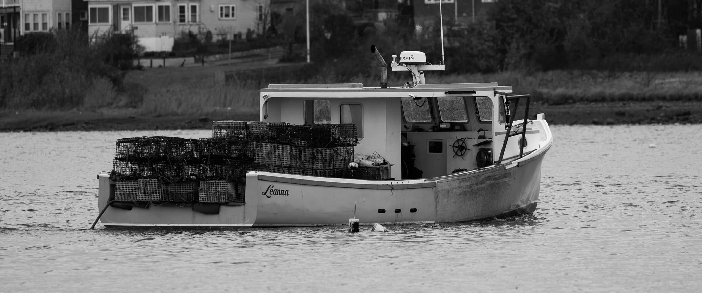</a>

<a href="#" data-featherlight="../../images/visuals/72.jpg">
    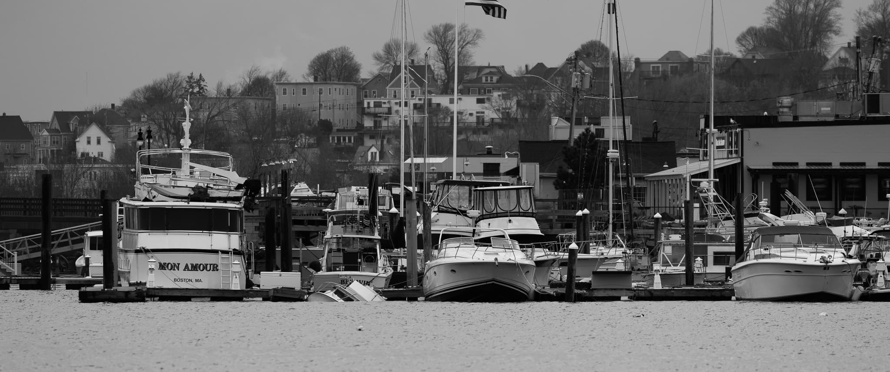</a>

---
<!-- airline -->

<a href="#" data-featherlight="../../images/visuals/20.jpg">
    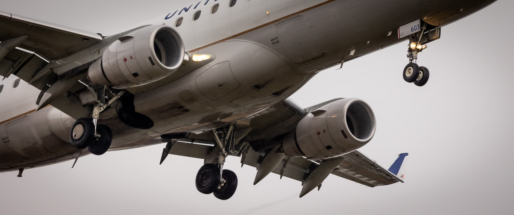</a>

    <b>
    2006年，在第十代微软模拟飞行发布之后不久，我开始自学 
    航空知识和飞机驾驶，在模拟器里想象自己是一名飞行员。 
     
    转眼十年后，2016年的暑假，上海浦东国际机场，美联航 
    747-400的驾驶舱里，我在摆弄着油门推杆和自动油门按钮， 
    副驾驶拿着我的摄影机笑嘻嘻地在拍着，飞了30年的机长 
    老爷子把他的帽子轻轻戴在我的头上说： 
    “keep up your dreams, son.” 
    </b>

    <b>
    董先生赠予我的机长肩章和SOP标准飞行手册，   
    在很长一段时间里都激励着我的小小飞行梦想。 
    他在海南航空作为飞行教员执飞E190多年， 
    至今仍在一线飞行。 
     
    相信未来自己每次看到这组美联航E190的特写， 
    都能记得年少时的那份激情。 
    </b>

<a href="#" data-featherlight="../../images/visuals/15.jpg">
    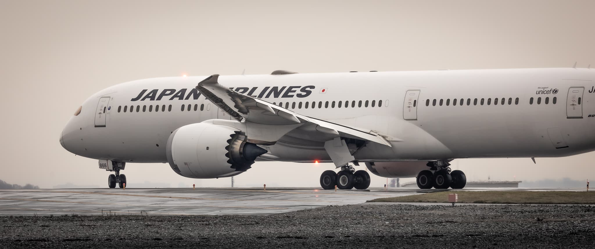</a>

    <b>
    JAL7/JL7, Boeing 787-9/B789, BOS/Boston-NRT/Tokyo, "日航大白鹤"  
    GEnx-1B引擎后整流罩上的波浪形边缘能够降低80%的最大推力噪音  
    </b>

<a href="#" data-featherlight="../../images/visuals/19.jpg">
    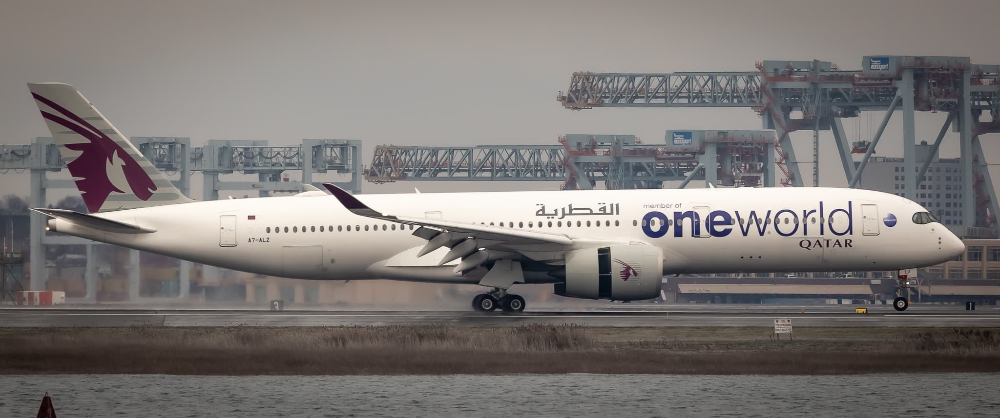</a>

    <b>
    QTR744/QR744, Airbus 350-900/A359, DOH/Doha-BOS/Boston, "oneworld special livery"  
    这是卡塔尔航空机队第一架带有寰宇一家航空联盟特别涂装的A350XWB  
    </b>

<a href="#" data-featherlight="../../images/visuals/17.jpg">
    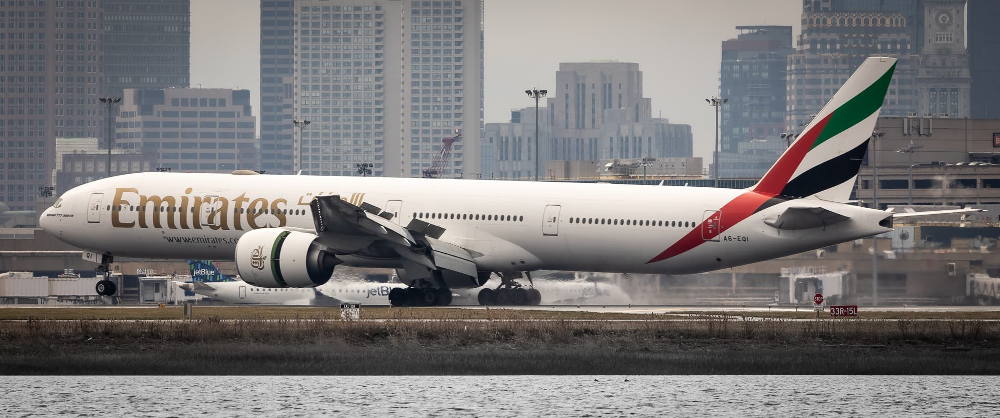</a>

    <b>
    UAE237/EK237, Boeing 777-300ER/B77W, DXB/Dubai-BOS/Boston, "GE90-115B: the most powerful jet engine"  
    作为世界上最大的双发喷气式客机，B77W永远是场上的老大哥  
    他所携带的两颗GE90-115B是世界上推力最强的喷气式发动机  
    任何一架B77W全推力起飞都是重型机械和暴力美学的极致演绎  
    </b>

---
<!-- calli -->

<a href="#" data-featherlight="../../images/visuals/23.PNG">
    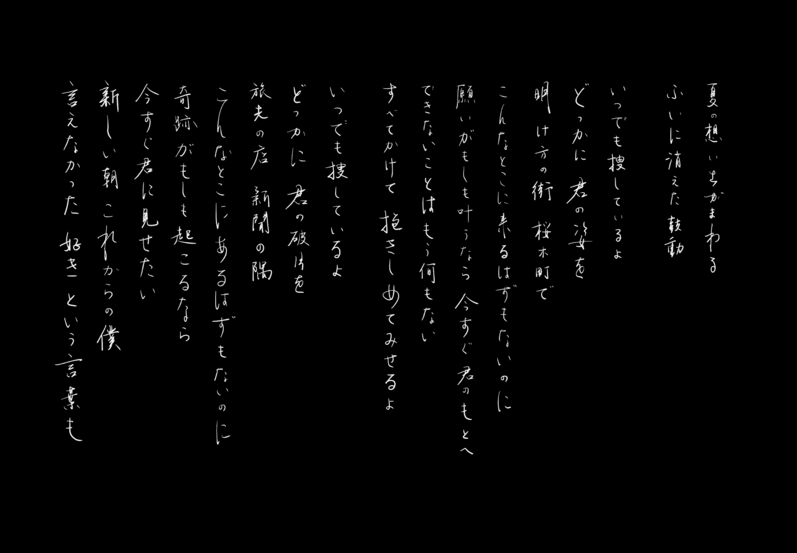</a>

    <b>
    《one more time, one more chance》 by 山崎まさよし  
    《秒速5センチメートル》主题曲 
    传统纵书，行书，自右向左阅读 
    </b>

 
 

    <a href="#" data-featherlight="../../images/visuals/22.jpg">
        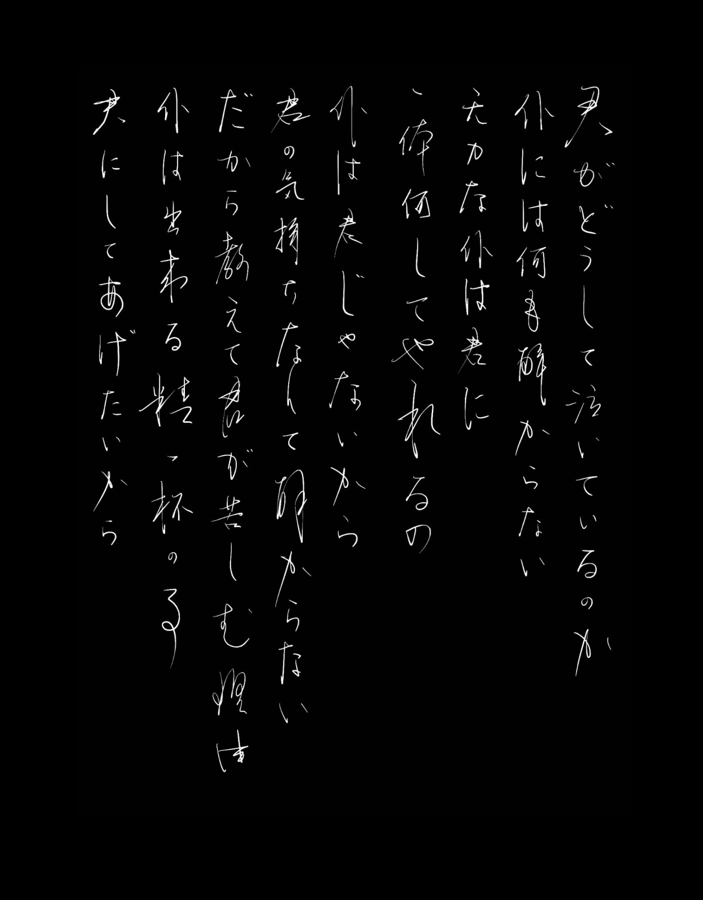</a>

    <b>
    《今、このとき。》 by 柊  
    《夏目友人帐》主题曲  
    传统纵书，行草，自右向左阅读 
    </b>

---
<!-- zed -->

    <a href="#" data-featherlight="../../images/visuals/173.jpg">
        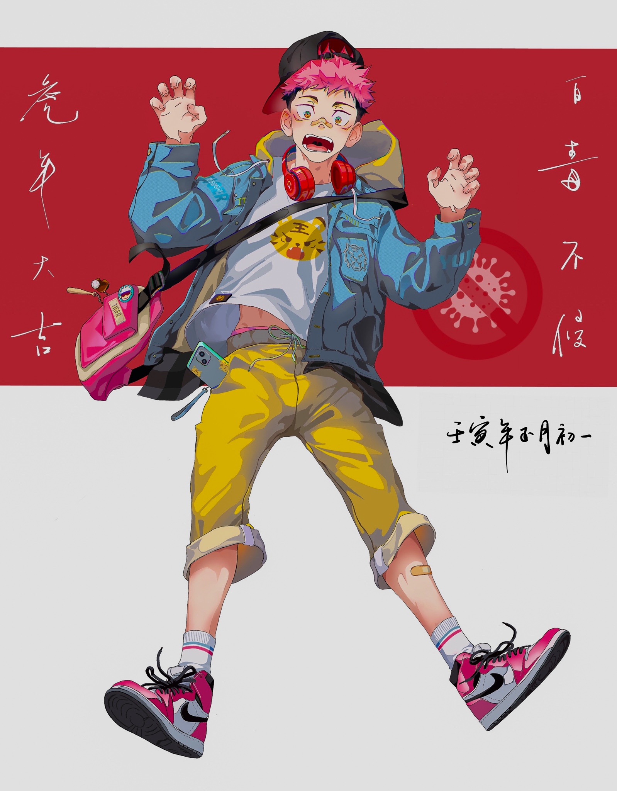</a>

    <b>
    いたどり ゆうじ in 呪術廻戦  
    by my extremely talented friend 
    <a href="http://zeyang.xyz/stories"> ze yang</a>  
    calligraphy by me :D  
     
    happy tiger year!  

