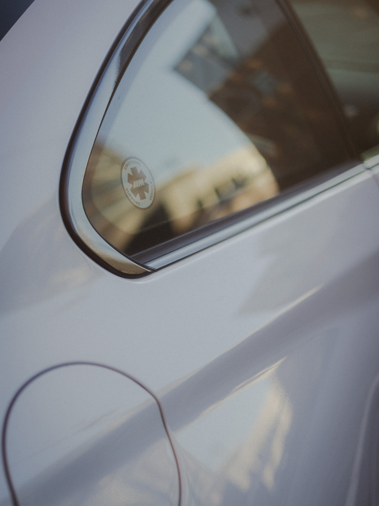

    "be my once in a lifetime" 
	 - lana del rey

<!--more-->

---
<!-- cover -->

<iframe width="3000" height="740"
    src="https://www.youtube.com/embed/FiAj1zIpz8Q?controls=0&amp;start=0&autoplay=0&loop=1" 
    title="YouTube video player"
    frameborder="0"
    allow="accelerometer; autoplay; loop; clipboard-write; encrypted-media; gyroscope; picture-in-picture; web-share" allowfullscreen></iframe>

    <b>
     
    2021 BMW F87 M2 Competition, "Alva the M2C"  
     
    3.0L Inline-6 Twin-Turbo ICE (450hp) & 7-speed DCT  
    Front 6-Piston and Rear 4-Piston Competition Brake Package  
    19-inch Competition Forged Aluminum Wheels & Michelin Pilot Super Sport  
    Executive Package & OEM Alcantara+Carbon Steering+Console Package  
    M2CS Front Spliter & Rear Ducktail & Remus Axleback  
    BMW M 50-year Anniversary Emblems  
     

---
<!-- long -->

    

    

---
<!-- 1207 -->

    

---
<!-- bw -->

---
<!-- back and front m2c -->

    

    

---
<!-- 1207 -->

    

    

---
<!-- film -->

    

    

---
<!-- autumn -->

    

---
<!-- cover -->

    

---
<!-- cover -->

    

---
<!-- back and front m2c -->

    

    

    

---
<!-- black m2c -->

    

---
<!-- m2c -->

    

---
<!-- white m2c -->

    

    

    

    

