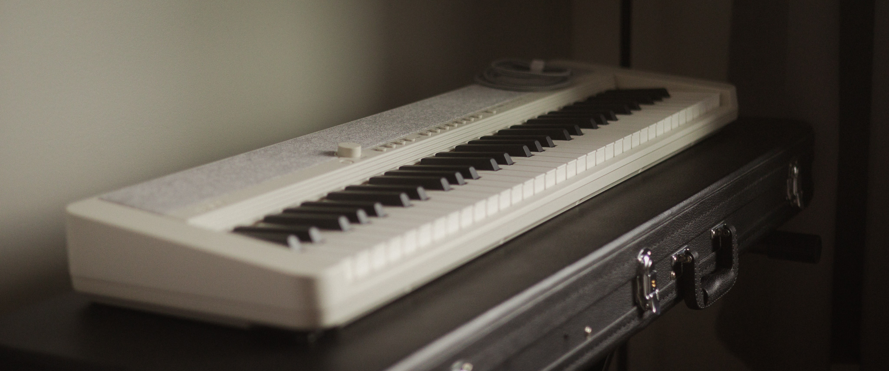
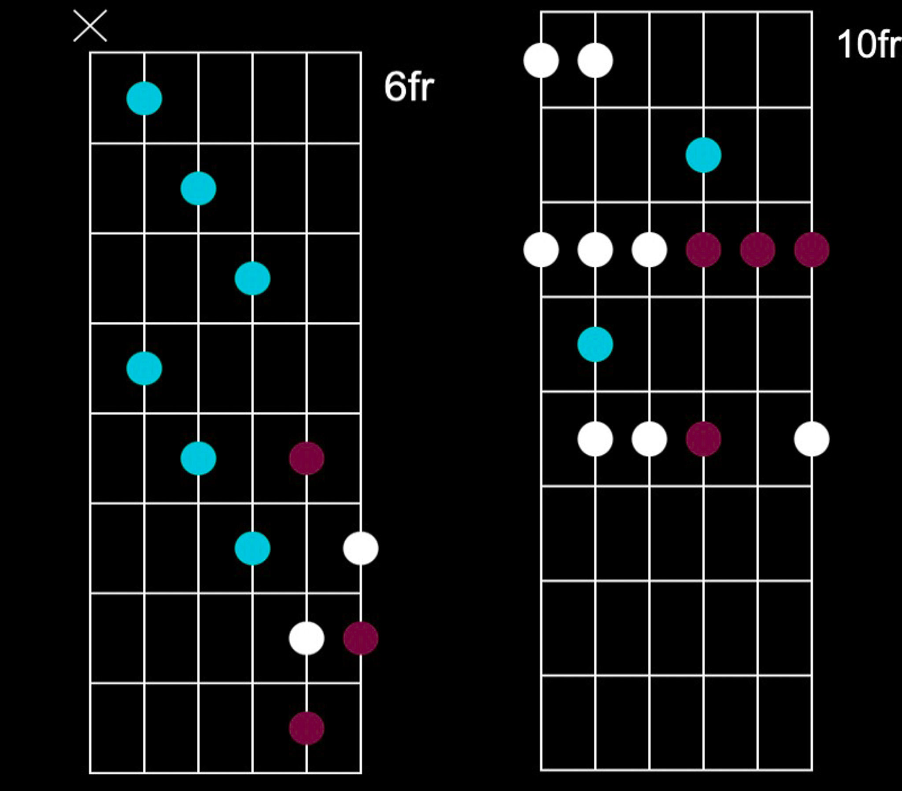
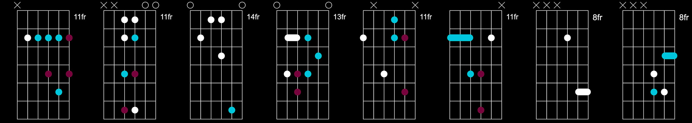
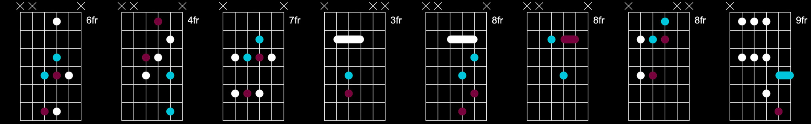
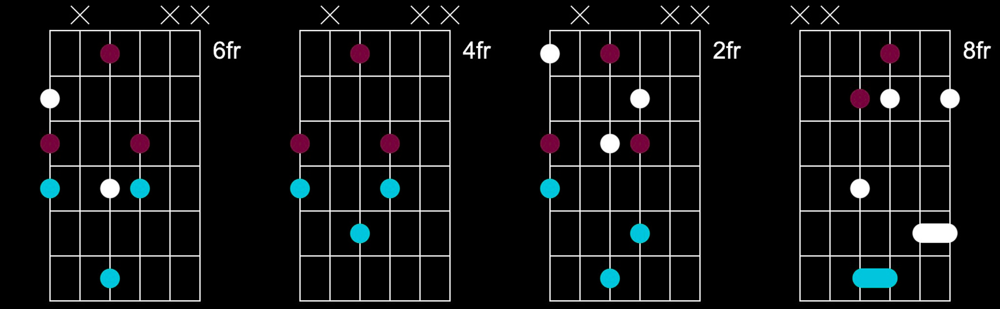
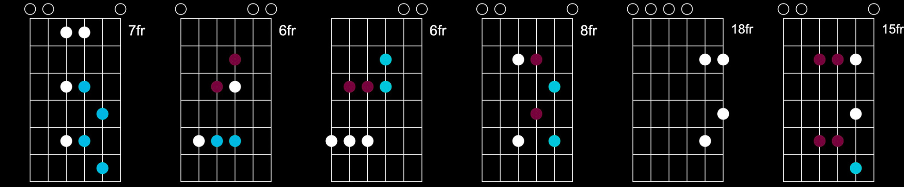
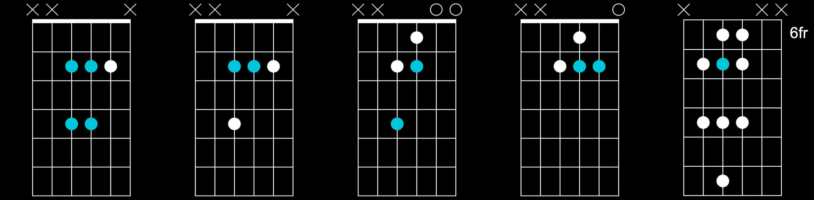
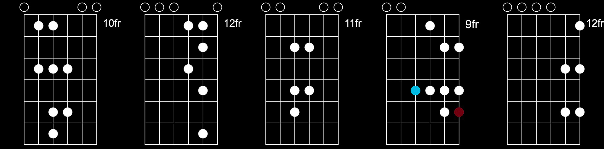

    "everything living has a rhythm" 
	 - michael jackson

<!--more-->

<!-- https://image.pi7.org/combine-multiple-images -->
<!-- https://chordpic.com/zh -->

---
<!-- intro -->

         
    <b>
    a collection of my fav licks and tracks  
    with simplified notes for chords and scales  
    only enough for me to recall the way i play them  
    most of the time, due to lack of official sheets  
    i create my own versions by ear  
         

---
<!-- drown -->
<!-- https://www.youtube.com/watch?v=RLH0FTBRuyo -->

    

    

    <b>
    drown, intro & solo, tim henson & mateus asato, e/g, [official](https://www.youtube.com/watch?v=9p8NMDcKkVw), [solo](https://www.youtube.com/watch?v=UWUZrkq6sWc)  
     

---
<!-- slow -->
<!-- https://www.youtube.com/watch?v=RLH0FTBRuyo -->

    

    <b>
    slow dancing in a burning room, intro, live in l.a., john mayer, c#/e, [video](https://www.youtube.com/watch?v=32GZ3suxRn4)  
     

---
<!-- higgs -->

    

    <b>
    higgs, frank ocean, c#/e, [video](https://www.youtube.com/watch?v=kE7hqV8c9Mk)  
     

---
<!-- deathwish -->

    

    <b>
    deathwish asr, instrumental, frank ocean, g/bb, [video](https://www.youtube.com/watch?v=ZZk5sV2HLoo&list=PLQX2Hw15QF_P5-lWbT8h4FWfXff7Rf9L_)  
     

---
<!-- feelings gone -->

    

    <b>
    feelings gone, frank ocean, f#/a, 80% in d/f, 70% in c/eb, [video](https://www.youtube.com/watch?v=_wAAZqaIcv0)  
     

---
<!-- u instru -->

    

    <b>
    u, part ii, instrumental, kendrick lamar, a/c, [video](https://www.youtube.com/watch?v=CN4qwhImWqQ)  
     

