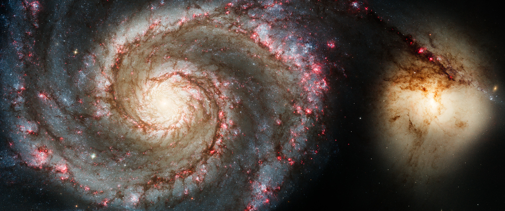
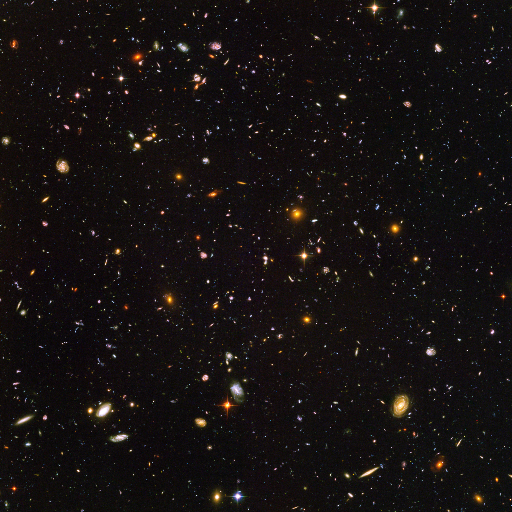

    "only two things are infinite, the universe and human stupidity" 
	 - albert einstein

<!--more-->

---
<!-- hudf -->

    

    <b>
    hubble ultra deep field (hudf),  
    representing 1/130000000 of the total sky,  
    containing more than 10000 galaxies.
     

