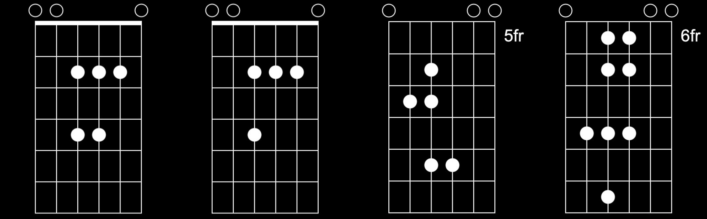

    "everything living has a rhythm" 
	 - michael jackson

<!--more-->

<!-- https://image.pi7.org/combine-multiple-images -->
<!-- https://chordpic.com/zh -->

---
<!-- deathwish -->

    

    <b>
    deathwish asr, instrumental, frank ocean, g/bb, [video](https://www.youtube.com/watch?v=ZZk5sV2HLoo&list=PLQX2Hw15QF_P5-lWbT8h4FWfXff7Rf9L_)  
     

---
<!-- feelings gone -->

    

    <b>
    feelings gone, frank ocean, f#/a, 80% in d/f, 70% in c/eb, [video](https://www.youtube.com/watch?v=_wAAZqaIcv0)  
     

---
<!-- u instru -->

    

    <b>
    u, part ii, instrumental, kendrick lamar, a/c, [video](https://www.youtube.com/watch?v=CN4qwhImWqQ)  
     

