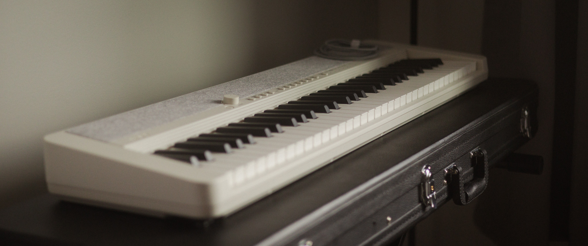
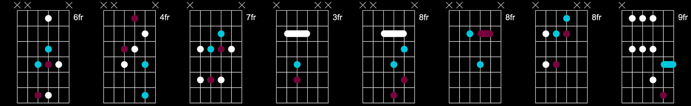
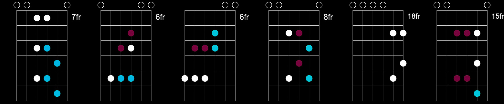
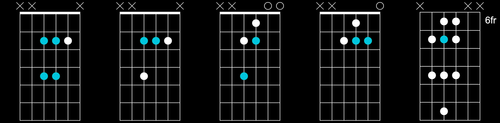
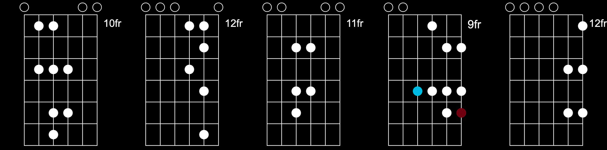

    "everything living has a rhythm" 
	 - michael jackson

<!--more-->

<!-- https://image.pi7.org/combine-multiple-images -->
<!-- https://chordpic.com/zh -->

---
<!-- intro -->

         
    <b>
    a collection of my fav licks and tracks  
    with highly simplified notes on chords and scales  
    only enough to let me recall the way i play them  
     
    most of these tracks have no tutorials or official sheets available online  
    so i create my own versions by ear, but they are not the only ways to play  
    i try to explore variations and replicate the most of the original version  
     
    however im too lazy to write full sheets for them so this is only for personal use  
    if you love any of the tracks and would like to know the details to play  
     
    im happy to chat  
    happy shredding  
         

---
<!-- slow -->
<!-- https://www.youtube.com/watch?v=RLH0FTBRuyo -->

    

    <b>
    slow dancing in a burning room, intro, live in l.a., john mayer, c#/e, [video](https://www.youtube.com/watch?v=32GZ3suxRn4)  
     

---
<!-- deathwish -->

    

    <b>
    deathwish asr, instrumental, frank ocean, g/bb, [video](https://www.youtube.com/watch?v=ZZk5sV2HLoo&list=PLQX2Hw15QF_P5-lWbT8h4FWfXff7Rf9L_)  
     

---
<!-- feelings gone -->

    

    <b>
    feelings gone, frank ocean, f#/a, 80% in d/f, 70% in c/eb, [video](https://www.youtube.com/watch?v=_wAAZqaIcv0)  
     

---
<!-- u instru -->

    

    <b>
    u, part ii, instrumental, kendrick lamar, a/c, [video](https://www.youtube.com/watch?v=CN4qwhImWqQ)  
     

