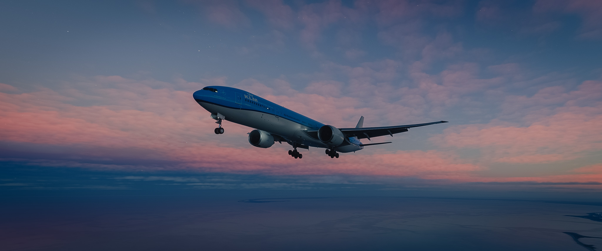
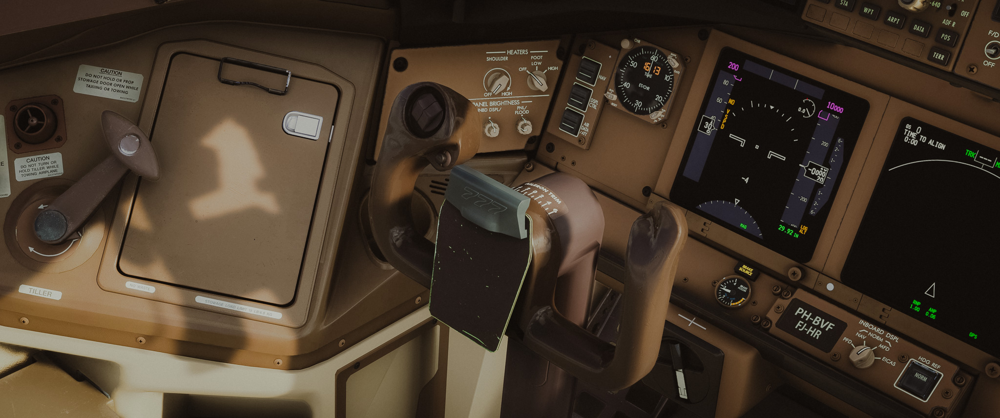
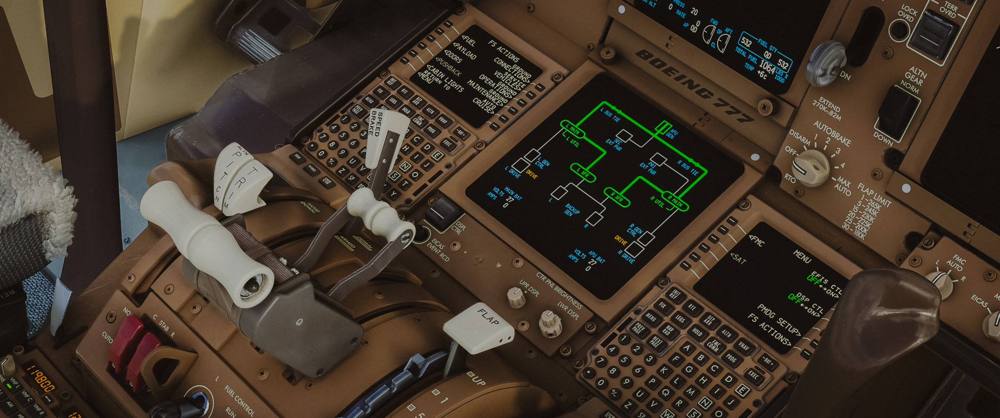
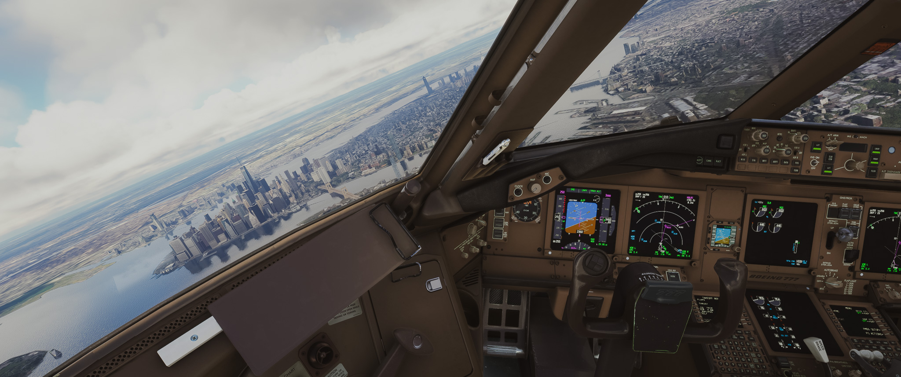
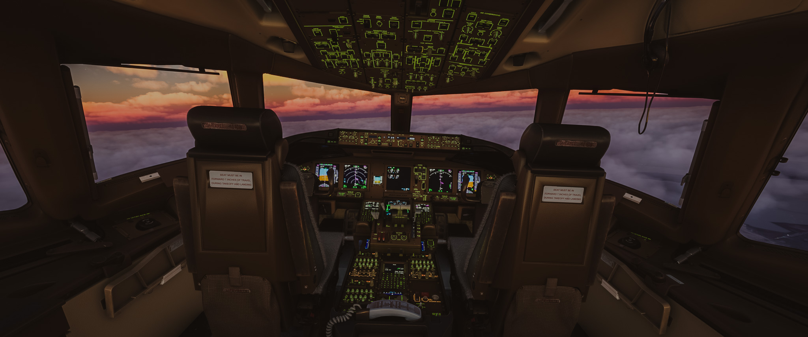
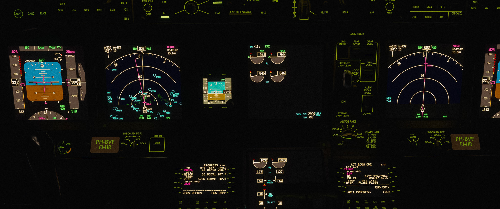
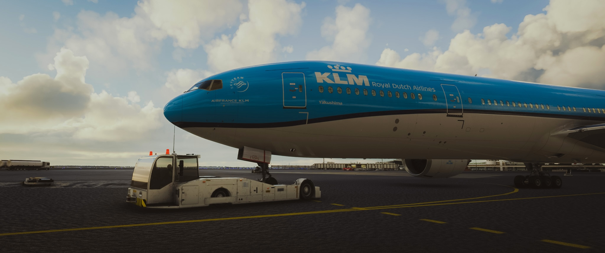
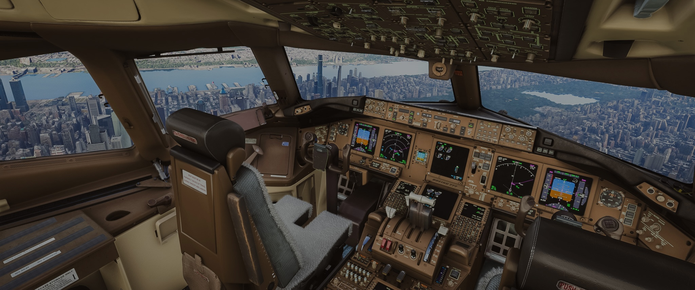
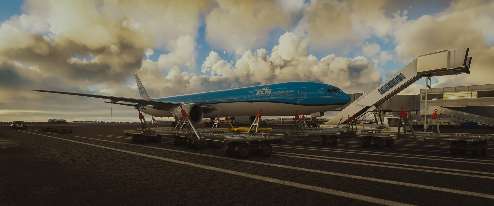
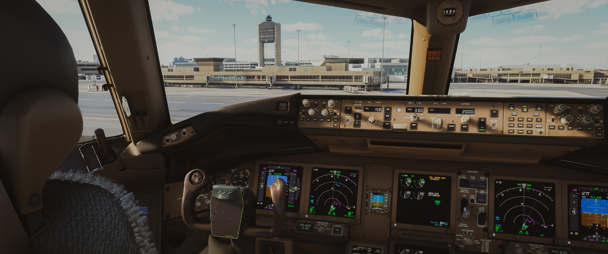

    "adventure is worthwhile in itself" 
	 - amelia earhart

<!--more-->

<!-- https://dispatch.simbrief.com/home -->

---
<!-- cd -->

    

    <b>
    a boeing 777-300er waiting for the irs to align and major systems to start up  
    (indicated by the blacked out pfd and nd)  

    

    <b>
    this vol is a very brief note on my speedrun routine flights on msfs + pmdg b77w  
    and a small selected collection of my fav shoots  

    

---
### pre-flight (speedrun)
- **get charts ready, check weather & forecasts, cold-dark with gpu startup**
- **pre-flight checklist** (start apu)
    - parking brake ... set
    - overhead
        - upper left
            - adiru ... on
            - thrust asym comp (tac) ... auto/on
            - prim flight computers ... auto, grd closed
        - elec
            - battery switch ... on
            - apu gen switch ... on
            - ife/pass seats ... on
            - cabin/utility ... on
            - pmy/secondary ext pwr ... avail -> on
            - l+r bus tie switches ... auto
            - l+r gen ctrl ... on
            - apu ... start -> on
    - fmc fs actions: fuel, payload, doors, wheel chocks ... checked
- **cockpit preparation checklist** (after apu on)
    - overhead
        - pass oxigen ... checked
        - window heat ... on
        - hydr
            - pmy l+r eng hydr pumps ... on
            - pmy c1+c2 elec hydr pump ... off
            - l+c1+c2+r demand hydr pump ... off
        - pass sign ... auto/on
        - engine/fuel
            - eec mode switches ... norm
            - engine start selectors ... norm
            - autostart switch ... on
            - l fwd fuel pump ... on
        - anti-ice ... as req
        - ac
            - equip cooling ... auto
            - gasper switch ... on
            - recirc fans ... on
            - ftl deck temp cntrols ... as req
            - l+r pack ctrl switches ... auto
            - l+r trim air switches ... on
            - l-c-r isolation values ... auto
            - eng + apu bleed air ... on/auto
        - pressurization panel ... set/auto
        - lights
            - nav lights ... on
            - exterior lights ... as req (logo lights as night)
            - cockpit lights ... as req
            - emerg exit lights ... armed, grd closed
    - atis/metar ... received
    - fmc ... init
        - `INIT REF`: pos init copy pos, perf init zfw, default 10.0k reserved, crz fl210, ci 99, thrust lim to/clb
        - `RTE`: request kjfkkbos001, activate, check in `DEP/ARR, ALTN, LEGS`
        - `VNAV`: clb check crz alt fl210, check 3 pages
        - `INIT REF - TAKEOFF`: flaps 15, confirm v1 vr v2 (check pfd), leave fmc at takeoff page, proceed to mcp for v2
    - mcp: ias/v2 - hdg/rwy heading - alt 3000 ... set
    - efis: mins, check weather metar for alt/baro, wxr, arpt, data, pos, and terr on
    - f/d ... on
    - a/t ... armed
    - lnav/vnav ... armed
    - flight instruments ... set, no flags
    - autobrake ... rto
    - comm/audio panel ... set
    - transponder/tcas ... set/test
    - aileron/rudder trim ... set
    - takeoff briefing ... complete
    - parking brake ... released
- *request clearance, groud service, pushback on msfs atc*

---
<!-- fly -->

    

    <b>
    kbos (boston logan int'l airport) to rjtt (tokyo haneda int'l airport, as shown below as destination in fmc)  
    total time 14h, one of the longest flights, my fav overnight run  

    

---
### fly

- **before start checklist**
    - fs actions
        - doors ... closed
        - ground equipment, jetway connection ... disconnected
        - wheel chocks ... removed
    - hydr
        - l+r elec demand hydr pumps ... auto
        - pmy c1+c2 elec hydr pumps ... on
        - c1+c2 air demand hydr pumps ... auto
    - fuel pumps
        - l+r fuel pumps ... all on
        - l+r center fuel pumps ... as req
    - lights
        - pass signs ... on
        - beacon ... on
    - recall ... push
- **engine start checklist**
    - engine area ... clear
    - sec display unit ... eng
    - engine start ... announce
    - apu bleed ... on, checked
    - engine 1/l start selector ... start
    - engine 1/l fuel control lever ... run after n2 stable
    - engine 2/r start selector ... start
    - engine 2/r fuel control lever ... run after n2 stable
- **before taxi checklist**
    - overhead
        - eng/apu
            - l/r gen ... on
            - elec and ac systems ... checked on efis
            - apu ... off
            - eng start selectors ... norm
        - ac
            - l/r pack control switches ... auto (lights off)
            - l-c-r isolation valves ... auto (lights off)
            - eng bleed air ... on (lights off)
        - lights
            - taxi lights ... on
            - rwy turn-off lights ... on
    - controls
        - flaps ... set 15 confirmed
        - stabilizer trim ... set __ units
        - flight controls ... checked
    - transponder ... standby
    - recall ... checked
    - lower display unit ... off
    - *request taxi clearance, 30% throttle taxi, max 30kts*
- **before takeoff checklist**
    - parking brake ... set
    - cabin lights ... as req
    - fmc takeoff ... v1, vr, v2 confirmed
    - mcp v2 ias ... confirmed
    - f/d, a/t, lnav/vnav ... on/armed
    - autobrake ... rto
    - *request taxi clearance, get on runway*
    - transponder ... ta/ra
    - tfc ... on
    - landing lights ... on
    - strobe light ... on
    - *clear for takeoff, 50% thrust and stable, to/ga engaged, standard takeoff procedure*
- **after takeoff checklist**
    - positive rate of climb ... gear up
    - flaps ... up gradually
    - auto-brake ... off
    - lights
        - taxi-light ... off
        - rwy turn-off lights ... off
        - cabin lights ... as req
    - ap ... engaged `THR REF | LNAV | VNAV SPD`
    - mcp ... as req by atc
    - below 10000ft ... max 250kias
    - passing 10000ft, landing lights ... off
    - altimeter passing ta/18000ft ... set std/29.92
    - fmc ... `PROG` 
- **cruise & descent prep**
    - engine & instruments ... monitor
    - fuel quantity ... checked
    - atis/airport info/weather/forecasts ... checked
    - mcp alt ... reset to 10000ft
    - fmc appr speed ref ... set and confirmed
    - localizer freq ... checked
- **descent**
    - anti-ice ... as req
    - landing alt ... checked
    - altimeter ... checked
    - radio alt / baro min ... checked
    - mcp ... check speed, use spoiler/`V/S` if necessary
    - fmc ... check approach page, confirm flaps and ref speed, check to/ga route and alt info
    - altimeter passing ta/18000ft ... local/metar
    - ias below 10000ft ... max 250kias
    - below 10000ft, landing lights ... on
    - mcp ... manual ias/vs, hdg req by atc
- **approach checklist**
    - loc freq/course ... checked
    - ap ... arm `LOC` then `APP`
    - `AP G/S` alive ... gear down
    - flaps ... down gradually as req, full 30 before final app, landing flaps checked
    - speedbrake ... armed
    - auto brake ... max/auto
- **landing checklist**
    - ga alt ... set
    - rwy turn-off lights ... on
    - landing gear ... down checked
    - ap & at ...  `LAND3, SPD | LOC (ROLLOUT) | G/S (FLARE)`, 1000ft ap disconnected, manual landing
    - *after touchdown*
    - reverse ... engaged, off below 60kias
    - max brake, 30kt exit
    - ap & at ... off
    - wxr ... off
    - transponder ... standby
    - flaps ... up
    - speed brakes ... up
    - auto brake ... off
    - lights
        - landing lights ... off
        - strobe lights ... off
        - taxi lights ... on
        - cabin lights ... as req
        - rwy turn-off lights ... off
    - anti-ice ... as req
    - apu ... start
- **shutdown checklist**
    - parking brake ... set
    - engine fuel control levers ... cutoff
    - groud service/operations ... as req
    - fmc fs actions ... doors
    - overhead
        - lights
            - pass signs ... off
            - beacon light ... off
            - logo lights ... as req
        - hydr
            - c1+c2 air demand hydr pumps ... off
            - l+r elec demand hydr pumps ... off
            - pmy c1+c2 elec hydr pumps ... off
        - fuel pumps ... all off
        - l+r pack controls ... off
    - f/d ... off
    - mcp and fmc ... reset
    - adiru ... off
    - emerg exit lights ... off
    - apu ... off
    - battery ... off
 

---
<!-- fly -->

    

    <b>
    klm b777-306er "yakushima" named after [屋久島](https://ja.wikipedia.org/wiki/%E5%B1%8B%E4%B9%85%E5%B3%B6) national park in japan  
    registration number ["PH-BVF"](https://www.planespotters.net/airframe/boeing-777-300er-ph-bvf-klm-royal-dutch-airlines/e967vg), delivered in feb 2011

    

    <b>
    kjfk + flyover on manhattan + kbos oceanic final approach  
    my fav routine quick speedrun flight that takes < 1h from cold-dark to cold-dark  

    

---
### plugins
- hdr 10 off, 1440p 120fps, all max quality except for all traffic
- pmdg boeing 777-300er + 737-800
    - all liveries, no tablet, no "no-smoking", colddark with gpu
    - callout: 80 knots, v1, rotate, v2, positive rate, 60-10&5
    - simulations: pause on tod, display powerup: fast
    - kjfkkbos001 (manhattan 3000ft flyover view)
        - `KJFK Gate 38, 31L, VERGE, HULBI, ALEKS, ROBUC3, KBOS 33L`
        - `ROBUC3: ROBUC, PROVI, JOODY, JAYNA, ANSLY, BEREI, BBOGG, (FINAL), COHAS, NIMOY, RW33L, (WAXEN)`
- world updates: usa and japan
- simfx 42: visual effects utility, 737 & 777 immersion (vfx pack)
- boston vfr objects, nyc times
- boston and nyc region water fix

### controller mappings
- with mouse:
    - left cross: views, rb+lb+cross: setup views
        - up: overhead panel
        - down: lower panel+throttle panel+eicas
        - right: pfd+nd+eicas+fmc
        - left: central/focus view for approach/landing
    - mouse right hold; left stick: moving around, scroll: zoom
    - rb hold (freelook lock): left stick moving, right stick view, u/d: height, l/r: zoom
    - left stick: control, press: toggle a/p and mute warning; right stick: mouse, press toggle
    - lt/rt: vertical stabilizer, y/b: throttle, a: cut throttle, x: brake, lb+rb: to/ga
    - rb+y/b: flaps, rb+a: toggle gear, rb+x: toggle parking brake
    - view: drone, controlled by two sticks and two triggers
- controller-only
    - left stick toggle interaction mode and cursor, x interact, a select, y/b rotate
    - lb hold, left stick flight control, press ap disconnect, y/b throttle, x brake, a cut
    - rb hold, y/b flaps, x parking brake, a gear
    - rb hold, camera view, left stick moving, right stick viewing, u/d height, l/r zoom
    - cross for views, rb+lb+cross save views

---
<!-- fly -->

    

    <b>
    for speedrun flights i always fly from random airports to kbos  
    with live weather and condition setups,  
    approaching and touching down at kbos 33l from the ocean always feel like going home  

    

    <b>
    i've been flying flight simulators for almost 20 years and still love every second of it  
    the impulse and desire to fly is in our genes  
     
    so fly!  

---
<!-- 738 -->

    <b>
    PMDG 738 SOP, CTC SPEEDRUN  
    QUICK REF FOR THE EXPERIENCED  
    KEWR 168 04L - LLUND - BAYYS - KBOS ORW7 ILS 33L  
     
     
     
    (FUEL LOAD 20%, 50% BY DEFAULT)  
    PARKING BRAKE - SET  
    BAT, STBY PWR, EMER EXIT LIGHTS - CLOSED  
    L FUEL PUMP - ON  
    APU - START  
    BASIC FMC, INIT/REF - SET  
     
    (OVERHEAD AFTER APU START)  
    APU GEN - ON  
    PASSENGER SIGN - ON  
    WINDOW HEAT PANEL - ALL ON  
    HYD PUMPS - ALL ON  
    ENG 1 BLEED - OFF  
    APU BLEED - ON  
    PACKS AND VALVES - AUTO  
    FLT ALT - AS REQUIRED  
    LIGHTS (POS, LOGO, ANTI-COLL) - ON  
    2 IRS - NAV  
    FMC/MCP - SET  
    DOORS AND GROUND - CLEARED  
    (REQUEST DEP/PB CLEARANCE)  
     
    (BEFORE START, AFTER PB)  
    PARKING BRAKE - SET  
    FUEL PUMPS - ON  
    PACKS - OFF  
    (START ENGINES)  
     
    (OVERHEAD)  
    YAW DAMPER - ON  
    GEN 1 & 2 - ON  
    PACKS AND VALVES - AUTO  
    APU BLEED - OFF  
    ENG 1 BLEED - ON  
    APU - OFF  
    ENG START - CONT  
    TAXI LIGHTS - ON  
    RWY TURNOFF LIGHTS - ON  
    FLAPS - 5/AS REQUIRED  
    CTRLS - CHECKED  
    AUTOBRAKE - RTO  
    FMC/MCP - SET  
    (REQUEST TAXI CLEARANCE, TAXI)  
     
    (LANDING LIGHTS ON, TAXI LIGHTS OFF, TAKEOFF)  
    (FLAPS UP, AUTOBRAKE AND GEAR OFF)  
    (A/P A/T ENGAGED, LNAV/VNAV)  
    (LANDING LIGHTS OFF PASSING 10000FT)  
    (ALTIMETER STD AFTER PASSING TA)  
     
    (PREP FOR DESCENT/APPROACH)  
    MCP ALT - RESET TO 10000FT  
    FMC APP VREF - SET  
    LOC FREQ - STANDBY  
    ILS LOC HDG - SET  
    (VNAV PATH ENGAGED, AUTO-DESCENT)  
     
    (HOLD AT 10000FT, REDUCE SPEED TO 250KT)  
    AUTOBRAKE - AS REQUIRED  
    ALTIMETER - LOCAL  
    LANDING LIGHTS - ON  
    LOC FREQ - ACTIVATED  
    LOC HDG - SET  
    FMC/MCP - CHECK  
    APP/CMD 2 - ARM  
    G/S ACTIVATED - GEAR DOWN  
    FLAPS - 30/AS REQUIRED  
    SPEED BRAKE - ARM  
    ENG START - CONT  
    (REQUEST LANDING CLEARANCE)  
     
    (TAXI TO GATE, SHUTDOWN)  
     
     
     
     

---
