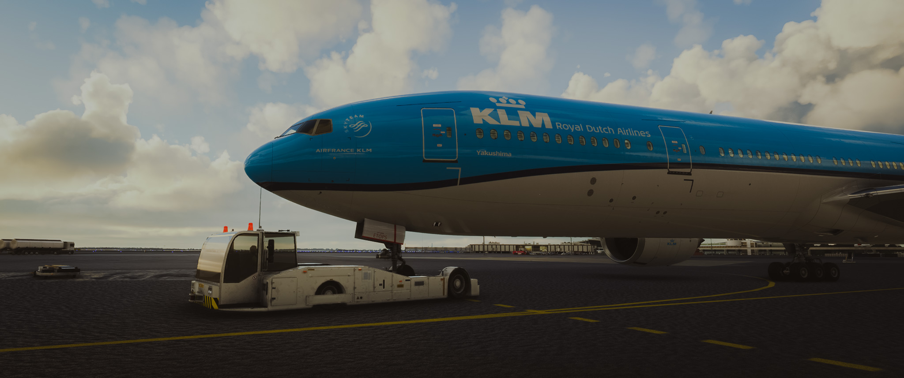
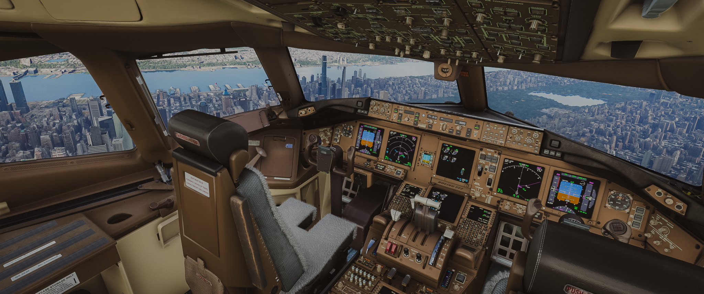

    "i could either watch it happen or be a part of it" 
	 - elon musk

<!--more-->

<!-- https://dispatch.simbrief.com/home -->

---
<!-- cd -->

    

    <b>
    a boeing 777-300er waiting for the irs to align and major system to start up  
    (as indicated by the blacked out primary-flight-display and navigation-display)  
     
    this vol is a very brief note on my speedrun routine flights on msfs + pmdg b77w  
    and a tiny selected collection of my fav shoots  

    

---
### prep (speedrun)

- parking brake pulled up
- **elec**: battery on, ground power both on, left pump on, gpu start, ife/pass seats on, cabin/utility on
- **overhead**: adiru on, emer lights on and case closed, window heat all on, hydraulic elec off, all pumps off, pass sign auto
- **lights and ac**: nav lights on, logo lights on for nights, check packs and bleed all auto/on
- **aircraft config**: cdu select fuel, payload, doors, check wheel chock
- **fmc initialization**:
    - `INIT REF`: pos init copy pos, perf init zfw, default 10.0k reserved, crz fl210, ci 99, thrust lim to/clb
    - `RTE`: request kjfkkbos001, activate, check in `DEP/ARR, ALTN, LEGS`
    - `VNAV`: clb check crz alt fl210, check 3 pages
    - `INIT REF - TAKEOFF`: flaps 15, confirm v1 vr v2 (check pfd), leave fmc at takeoff page, proceed to mcp for v2
- **mcp and efis**
    - efis: mins, check weather metar for alt/baro, wxr, arpt, data, pos, and terr on
    - mcp: fd on, ar armed, v2 input, hdg runway heading, alt 3000, lnav/vnav armed, mcp set
- **release all ground/jetway connections, close door, remove wheel chocks, and request groud service, pushback on msfs atc**

---
<!-- fly -->

    

    <b>
    kbos (boston logan int'l airport) to rjtt (tokyo haneda int'l airport, as shown below as destination in fmc)  
    total time 14h, one of the longest flights, my fav overnight run  

    

---
### fly
- **engine start**: all fuel pumps on, apu bleed on, engine start, n2 stable, fuel control run, 2/r first
- **apu shutdown**: check engine gen and ac working on efis, apu off, hydraulic pumps all auto, elec pumps on
- **lights**: beacon, strobe, taxi on, double check overhead
- **taxi**: transponder standby, autobrake rto, flaps to 15, 30% throttle taxi, fctl check
- **takeoff**: transpoder ta/ra, landing lights on, runway turnoff lights on, 50% thrust and to/ga engaged, ap engaged `THR REF | LNAV | VNAV SPD`
- **climb**: 250kt/10000, pass 10000 turn off landing lights and runway turnoff lights, pass 18000 baro std
- **before descent**: set altitude to 10000ft (mcp msg warning), autopause and auto descent, mind speed, use spoiler/`V/S` if necessary
- **fmc/mcp**: check approach page, confirm flaps and ref speed, check to/ga route and alt info, baro adjusted after 18000 based on metar
- **10000ft/250kt**: landing/rt lights, reduce speed to 250kt-, manual speed/vs, hdg use if needed, runway otherwise, flaps down, arm `LOC` then `APP`
- **final approach**: flaps 30, speed confirmed, gear down, rto max/auto, spoiler armed, min confirmed, `LAND3, SPD | LOC (ROLLOUT) | G/S (FLARE)`
- **manual landing**: 1000ft ap disconnected, manual landing
- **after touchdown**: reverse, max brake, 30kt exit, landing lights off, flaps up, spoiler up, rto off, wxr off, transpoder standby, apu start
- **shutdown**: parking brake on, engine fuel cutoff, clear efis, mcp and fmc, lights off, elec off, hydraulic pumps all off, emer lights off, done

---
<!-- fly -->

    

    <b>
    kjfk + flyover on manhattan + kbos oceanic final approach  
    my fav routine quick speedrun flight that takes < 1h from cold-dark to cold-dark  

    

---
### plugins
- hdr 10 off, 1440p 120fps, all max quality except for all traffic
- pmdg boeing 777-300er + 737-800
    - all liveries, no tablet, no "no-smoking", colddark with gpu
    - callout: 80 knots, v1, rotate, v2, positive rate, 60-10&5
    - simulations: pause on tod, display powerup: fast
    - kjfkkbos001 (manhattan 3000ft flyover view)
        - `KJFK Gate 38, 31L, VERGE, HULBI, ALEKS, ROBUC3, KBOS 33L`
        - `ROBUC3: ROBUC, PROVI, JOODY, JAYNA, ANSLY, BEREI, BBOGG, (FINAL), COHAS, NIMOY, RW33L, (WAXEN)`
- world updates: usa and japan
- simfx 42: visual effects utility, 737 & 777 immersion (vfx pack)
- boston vfr objects, nyc times
- boston and nyc region water fix

### controller mappings
- left cross: views, rb+lb+cross: setup views
    - up: overhead panel
    - down: lower panel+throttle panel+eicas
    - right: pfd+nd+eicas+fmc
    - left: central/focus view for approach/landing
- mouse right hold; left stick: moving around, scroll: zoom
- rb hold (freelook lock): left stick moving, right stick view, u/d: height, l/r: zoom
- left stick: control, press: toggle a/p and mute warning; right stick: mouse, press toggle
- lt/rt: vertical stabilizer, y/b: throttle, a: cut throttle, x: brake, lb+rb: to/ga
- rb+y/b: flaps, rb+a: toggle gear, rb+x: toggle parking brake
- view: drone, controlled by two sticks and two triggers
- controller-only operation still pending but possible

---
<!-- fly -->

    

    <b>
    for speedrun flights i always fly from random airports to kbos  
    with live weather and condition setups,  
    approaching and touching down at kbos 33l from the ocean always feel like going home  

    

    <b>
    i've been flying flight simulators for almost 20 years and still love every second of it  
    the impulse and desire to fly is in our genes  
     
    so fly!  

